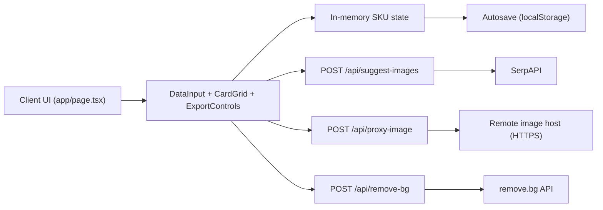

# Why It's Hot

[](https://github.com/gkmur/whyitshot/actions/workflows/ci.yml)

Top-SKU workflow app for collecting products, polishing images, and exporting ready-to-share visual summaries.

## Local Development

```bash
npm install
npm run dev
```

## Environment Variables

Create `/Users/gabrielmurray/dev/whyitshot/.env.local` with the keys you plan to use:

```bash
SERPAPI_KEY=your_serpapi_key
REMOVEBG_API_KEY=your_removebg_key
```

- `SERPAPI_KEY`: enables image suggestions.
- `REMOVEBG_API_KEY`: enables background removal.

## Quality Checks

```bash
npm run lint
npm run test
npm run build
```

## Architecture



- Main client orchestrator: `/Users/gabrielmurray/dev/whyitshot/app/page.tsx`
  - Owns SKU state, undo-clear behavior, background-removal toggles, and abort controllers for in-flight image processing.
- Persistence:
  - `/Users/gabrielmurray/dev/whyitshot/lib/use-autosave.ts` debounces saves.
  - `/Users/gabrielmurray/dev/whyitshot/lib/storage.ts` stores only serializable SKU fields in `localStorage`.
- API routes:
  - `/Users/gabrielmurray/dev/whyitshot/app/api/suggest-images/route.ts`: queries SerpAPI and streams normalized thumbnails.
  - `/Users/gabrielmurray/dev/whyitshot/app/api/proxy-image/route.ts`: validates/limits remote image fetches and returns safe image bytes.
  - `/Users/gabrielmurray/dev/whyitshot/app/api/remove-bg/route.ts`: calls remove.bg with size checks and timeout/error mapping.

## Troubleshooting

- `Image search not configured`:
  - Add `SERPAPI_KEY` to `/Users/gabrielmurray/dev/whyitshot/.env.local`.
  - Restart `npm run dev`.
- `Background removal not configured`:
  - Add `REMOVEBG_API_KEY` to `/Users/gabrielmurray/dev/whyitshot/.env.local`, or disable auto-remove backgrounds in the UI.
- API timeout errors (`Search timed out`, `Fetch timed out`, `Background removal timed out`):
  - Retry the action; upstream providers or remote image hosts may be slow/unavailable.
- Cloudflare deploy auth error `code: 10000`:
  - See `/Users/gabrielmurray/dev/whyitshot/docs/solutions/deployment-errors/cloudflare-auth-token-precedence-20260211.md`.
